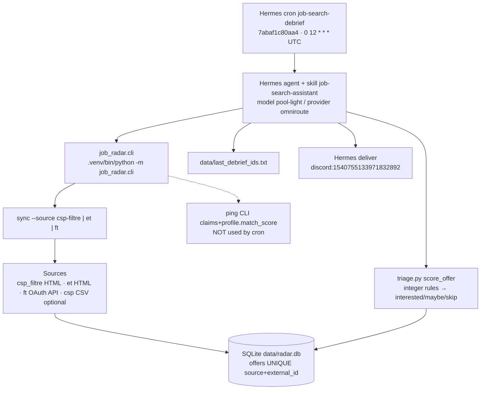
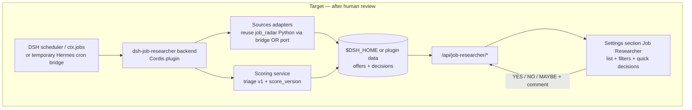

# DSH Job Researcher — Existing System Audit

**Date:** 2026-09-16  
**Status:** COMPLETE (with documented UNKNOWNs)  
**Scope:** Hermes live job-search pipeline + DSH plugin conventions + scaffold `dsh-job-researcher`  
**Non-goals of this mission:** migrate production, replace cron, implement full UI/scoring, ML feedback loop  

Evidence commands used include: `jq`/`python` on `~/.hermes/cron/jobs.json`, `sqlite3` on `radar.db`, `systemctl --user list-timers`, `crontab -l`, filesystem inspection under `job-radar/` and `~/dsh-lab/plugins/`.

---

## 1. Executive Summary

The live job-search system is **not** inside DSH. It is a Hermes scheduled agent cron (`job-search-debrief`, id `7abaf1c80aa4`) that orchestrates a local Python package **`job-radar`** at:

`/home/mestryx/WorkSpace/cockpit/projects/emploi/job-radar`

Daily flow: sync sources → deterministic CLI triage → French Discord debrief via Hermes deliver. Scoring used by the cron is **deterministic integer rules** in `triage.py` (not an LLM score). A second weighted claims-to-ping scorer exists but is **not** invoked by the cron.

DSH has **no** career/job plugin yet (only a `career` agent preset). Best UI+storage references are `dsh-piblox-discord` and `dsh-piblox-secrets`. Scaffold plugin `dsh-job-researcher` now exists under `~/dsh-lab/plugins/` as **scaffold / unwired**.

---

## 2. Current Architecture



---

## 3. Current Execution Flow

1. Hermes gateway fires cron `7abaf1c80aa4` at `0 12 * * *` (12:00 UTC).
2. Agent loads skill `job-search-assistant` and follows the **prompt** (SSOT process), not the skill’s aspirational APPLY/RELANCE narrative.
3. `cd /home/mestryx/WorkSpace/cockpit/projects/emploi/job-radar`
4. Sync: `csp-filtre`, then `et`, then `ft` if credentials OK (failure of one source = note, not abort).
5. Diff new offers vs checkpoint `data/last_debrief_ids.txt` (fallback: 15 most recent).
6. Dedup by `external_id` (agent-level; DB already has `UNIQUE(source, external_id)`).
7. `.venv/bin/python -m job_radar.cli triage --limit <N> --apply` → writes `interest` + reasons path via DB fields.
8. Compose FR Discord debrief (INTERESSE / A VOIR / PAS POUR MOI).
9. Update checkpoint; optional Hindsight retain; Hermes deliver.

**Verified:** `last_status: ok`, `last_run_at: 2026-09-15T12:05:25Z`, `repeat.completed: 28`.

---

## 4. Scheduler / Cron

| Field | Evidence |
|-------|----------|
| Job id | `7abaf1c80aa4` |
| Name | `job-search-debrief` |
| File | `~/.hermes/cron/jobs.json` |
| Schedule | `0 12 * * *` |
| Enabled | `true` / state `scheduled` |
| Model / provider | `pool-light` / `omniroute` |
| Skill | `job-search-assistant` |
| Script / no_agent | `null` / `false` (agent-driven) |
| workdir | `null` (prompt forces cd) |
| deliver | `discord:1540755133971832892` |
| systemd timers job-related | **none** |
| crontab | **empty** |

**Stale doc:** `cockpit/knowledge/discord/job-search-cron.md` still mentions older provider/model and a different deliver thread than live `deliver`. Prompt text still cites thread `1540741266998960189` while `deliver` targets channel `1540755133971832892` — **incoherence**.

---

## 5. Job Sources

| Source id | Module | Method | Endpoint / URL pattern | Auth |
|-----------|--------|--------|------------------------|------|
| `csp` (filtre) | `sources/csp_filtre.py` | HTML scrape | `choisirleservicepublic.gouv.fr/nos-offres/filtres/...` | none |
| `csp` (opendata) | `sources/csp.py` | data.gouv dataset → CSV cache | open data API + `data/cache/csp-offres-latest.csv` | none |
| `et` | `sources/et.py` | HTML scrape | `emploi-territorial.fr` dept 038 | session cookie |
| `ft` | `sources/ft.py` | REST OAuth2 | France Travail Offres v2 | `FT_CLIENT_ID` / `FT_CLIENT_SECRET` |

Cron Plan B sources: **`csp-filtre` + `et`** (+ `ft` if creds). Open-data `csp` sync exists but is not in the cron prompt Plan B line.

---

## 6. Data Acquisition

- **csp-filtre:** one HTML page of offer cards; filters baked into URL path (Isère / Numérique / Cat B defaults in code).
- **et:** keyword POST + category GETs; `search-limit=50`; in-memory dedup by offer id.
- **ft:** 10 `QUERY_PROFILES` keyword searches; dept 38 + communes + remote; `Range: offres=0-(max-1)`; default max 50/query; small sleeps between calls.
- **csp CSV:** full stream filtered locally (IT + geo).

---

## 7. Normalization

`models.Offer` + `normalize.py` fields:

`source`, `external_id`, `title`, `employer`, `location`, `contract_type`, `work_time` (`full|part|unknown`), `remote` (`yes|no|unknown`), `url`, `description`, `rome_codes`, `raw_json`, `tags[]`, `interest` (default `unset`), `notes`.

Derived tags include geo/public/plan_b markers (`geo_preferred`, `csp_filtre`, `emploi_territorial`, …).

Description truncated on upsert to 8000 chars; `raw_json` to 20000 (`db.upsert_offer`).

---

## 8. Deduplication

| Layer | Mechanism |
|-------|-----------|
| SQLite | `UNIQUE(source, external_id)` + `ON CONFLICT DO UPDATE` (preserves `interest` / does not reset user triage on content update; refreshes content + `last_seen_at`; merges tags) |
| ET iterator | in-memory `seen` set |
| Cron prompt | agent dedup by `external_id` |
| Ping path | employer-level grouping (best match_rate) |

**Observed issue:** live `et` rows have empty `url` despite current `row_to_offer` intending to set URLs — treat as legacy/data bug (**UNKNOWN** root cause without replay).

---

## 9. Scoring System

### 9.1 Cron path (ACTIVE) — `triage.py::score_offer`

Deterministic integer score. **No LLM.** Profile constants hardcoded in module.

| Rule | Delta |
|------|-------|
| Corridor Grenoble commune tokens | +2 |
| Far commune tokens | −1 |
| Strong infra/dev role tokens | +2 |
| Support/helpdesk tokens | +1 |
| Interco/métropole employer | +0 (reason only) |
| Alternance/stage tokens | −2 |

Verdict thresholds:

- `score >= 3` → `interested` (Discord INTERESSE)
- `score >= 1` → `maybe` (A VOIR)
- else → `skip` (PAS POUR MOI)

Scale: unbounded integer (typical small range). Reasons list stored via triage apply path into interest/notes workflow.

Evidence: `job-radar/src/job_radar/triage.py` ~L140–188.

### 9.2 Claims-to-Ping (ACTIVE CLI, UNUSED by cron) — `claims.py` + `profile.py` + `ping.py`

1. Extract typed claims from offer text.
2. `match_score(claims, Profile)` with YAML `profile.yaml` weights:

```
skill:3 · role:2 · location:4 · contract:2 · sector:1 · work_time:1 · employer_size:0.5 · benefit:0.5
```

3. `points = weight * confidence` if claim value ∈ accepted; `match_rate = total/max` capped at 1.0.
4. Required kinds missing → verdict `no_match`.
5. Else: `≥0.7` strong_match · `≥0.4` partial_match · else weak_match.
6. Ping actions / anti-spam employer grouping in `ping.py`.

### 9.3 Skill narrative (NOT the live scorer)

`job-search-assistant` mentions aspirational thresholds (e.g. score>0.75) that **do not** describe `triage.py`. Do not treat the skill text as scoring SSOT.

---

## 10. Storage

| Artefact | Tech | Path | PK / identity |
|----------|------|------|---------------|
| Offers | SQLite | `…/job-radar/data/radar.db` table `offers` | `id` AUTOINCREMENT; logical key `(source, external_id)` |
| Checkpoint | text file | `data/last_debrief_ids.txt` | one id per line (~4134 lines ≈ near-full DB) |
| CSP cache | CSV | `data/cache/csp-offres-latest.csv` | — |
| Cron outputs | Markdown | `~/.hermes/cron/output/7abaf1c80aa4/*.md` | run timestamp files |
| Profile | YAML | `job-radar/profile.yaml` | used by ping only |

Live counts (2026-09-16): `csp` 3780 · `ft` 335 · `et` 13 · interest `interested` 396 / `maybe` 1871 / `skip` 1861 / `unset` 0.

Schema excerpt: see `db.py` `SCHEMA` (interest, notes, tags JSON-as-text, first/last_seen_at).

---

## 11. Outputs / Notifications

- **Primary:** Discord via Hermes `deliver` (`discord:1540755133971832892`)
- **CLI:** list/show/triage/stats/export/ping stdout
- **Export:** markdown tables via `export.py`
- **Optional:** Hindsight retain (prompt) with tags `project:homelab` / `topic:job-search` (prompt text; bank usage may also use `project:emploi` elsewhere — reconcile carefully)
- **No** DSH dashboard UI for offers today

---

## 12. File Inventory

Format: PATH / ROLE / CALLED_BY / CALLS / INPUT / OUTPUT / STATE / NOTES

```text
/home/mestryx/.hermes/cron/jobs.json
ROLE: Hermes cron definitions (job-search-debrief)
CALLED_BY: hermes-gateway scheduler
CALLS: Hermes agent runtime
INPUT: schedule + prompt + skill + deliver
OUTPUT: cron runs + ~/.hermes/cron/output/7abaf1c80aa4/
STATE: ACTIVE
NOTES: id 7abaf1c80aa4; deliver vs prompt thread mismatch

/home/mestryx/WorkSpace/cockpit/projects/emploi/job-radar/src/job_radar/cli.py
ROLE: orchestration CLI (Typer)
CALLED_BY: cron agent, humans, console script job-radar
CALLS: sources/*, db, triage, ping, export, config
INPUT: CLI args + .env via config
OUTPUT: stdout + SQLite writes
STATE: ACTIVE

…/job_radar/triage.py
ROLE: daily deterministic scoring
CALLED_BY: cli triage
CALLS: fold helpers / token lists
INPUT: offer row dict
OUTPUT: Triage(verdict, score, reasons)
STATE: ACTIVE
NOTES: cron SSOT scorer

…/job_radar/db.py
ROLE: SQLite persistence
CALLED_BY: cli
CALLS: sqlite3
INPUT: Offer
OUTPUT: radar.db
STATE: ACTIVE

…/job_radar/sources/csp_filtre.py
ROLE: Plan B scrape CSP filtered page
CALLED_BY: cli sync --source csp-filtre
CALLS: httpx, normalize
INPUT: HTML
OUTPUT: Offer source=csp
STATE: ACTIVE

…/job_radar/sources/et.py
ROLE: Plan B scrape emploi-territorial
CALLED_BY: cli sync --source et
CALLS: httpx
INPUT: HTML
OUTPUT: Offer source=et
STATE: ACTIVE
NOTES: live URLs empty — investigate

…/job_radar/sources/ft.py
ROLE: France Travail Offres API
CALLED_BY: cli sync --source ft
CALLS: OAuth + httpx
INPUT: FT_* env
OUTPUT: Offer source=ft
STATE: ACTIVE

…/job_radar/sources/csp.py
ROLE: CSP open-data CSV sync
CALLED_BY: cli sync --source csp
CALLS: httpx, csv
INPUT: data.gouv dataset
OUTPUT: Offer source=csp
STATE: ACTIVE
NOTES: not in cron Plan B prompt

…/job_radar/claims.py + profile.py + ping.py + profile.yaml
ROLE: weighted claims-to-ping scorer
CALLED_BY: cli ping
CALLS: each other
INPUT: offers + profile.yaml
OUTPUT: PingBatch / match_rate
STATE: ACTIVE (CLI) / UNUSED (cron)

…/job_radar/job_radar/claims_pipeline/* (root shadow package)
ROLE: stub alternate pipeline
CALLED_BY: none (not installed)
CALLS: broken imports
INPUT: —
OUTPUT: —
STATE: DEAD CODE

…/job-radar/debrief.py , parse_new.py , *.txt root artefacts
ROLE: one-shot helpers / archives
CALLED_BY: manual historical
CALLS: ad-hoc
INPUT: logs / id lists
OUTPUT: text
STATE: LEGACY / DEAD CODE

ai-reusable-kit/.agents/skills/job-search-assistant/SKILL.md
ROLE: skill pinned by cron
CALLED_BY: Hermes cron
CALLS: —
INPUT: —
OUTPUT: agent guidance
STATE: ACTIVE but MISALIGNED with triage CLI reality → treat as REWRITE candidate

ai-reusable-kit/.agents/skills/emploi/emploi-offer-selection/SKILL.md
ROLE: human/agent ad-hoc selection help
CALLED_BY: Discord threads / agents
CALLS: documents SQL/geo rules
INPUT: radar.db
OUTPUT: guidance
STATE: ACTIVE (not cron pin)

cockpit/knowledge/discord/job-search-cron.md
ROLE: purported SSOT wiring doc
CALLED_BY: humans
CALLS: —
INPUT: —
OUTPUT: —
STATE: LEGACY/STALE (provider/model/deliver)

~/dsh-lab/plugins/dsh-job-researcher/**
ROLE: future DSH plugin scaffold
CALLED_BY: none (unwired)
CALLS: soft webServer + settings.section
INPUT: —
OUTPUT: placeholder Settings + /api/job-researcher/status
STATE: ACTIVE scaffold (not live)
```

---

## 13. Dependencies

**Python (`pyproject.toml`):** `httpx>=0.27`, `python-dotenv>=1.0`, `pyyaml>=6.0`, `typer>=0.12`; Python `>=3.12`; dev `pytest>=8`.

**System / runtime:** `sqlite3`, Hermes gateway, Discord delivery plane, optional Hindsight MCP/CLI.

**External APIs:** France Travail OAuth + Offres v2; data.gouv CSP dataset; public HTML sites CSP + emploi-territorial.

**DSH (future):** Node `>=22`, Cordis, WebUI slots — not required by current job-radar.

---

## 14. Configuration & Environment Variables

Names only (no values):

```text
FT_CLIENT_ID=<SECRET>
FT_CLIENT_SECRET=<SECRET>
FT_TOKEN_URL=<OPTIONAL>
FT_API_BASE=<OPTIONAL>
DB_PATH=<OPTIONAL>
```

Hermes-related names observed in ecosystem (not necessarily job-radar `.env`):

```text
DISCORD_HOME_CHANNEL=<OPTIONAL>
DISCORD_HOME_CHANNEL_THREAD_ID=<OPTIONAL>
HINDSIGHT_TIMEOUT=<OPTIONAL>
```

Config files: `job-radar/.env`, `.env.example`, `profile.yaml`, Hermes `jobs.json`.

---

## 15. Failure Handling

- Per-source sync failure: continue (prompt rule).
- FT missing/invalid credentials: skip FT.
- Upsert preserves existing `interest` on conflict (no wipe of triage).
- Cron provider rate-limit history (past): mitigated by pinning `omniroute`/`pool-light`.
- Expired offers: **UNKNOWN** dedicated expiry job — only `last_seen_at` refresh semantics; no explicit “expired” status column.

---

## 16. Logging / Observability

- Hermes cron output markdown under `~/.hermes/cron/output/7abaf1c80aa4/`
- Agent stdout summary (offer counts / buckets / sources)
- No dedicated Prometheus metrics for job-radar
- SQLite is the durable offer ledger

---

## 17. Existing DSH Plugin Architecture

Plugins live at `~/dsh-lab/plugins/<id>/` (**one git repo per id**, O-05=c). Detection = `package.json` → `dsh.bundle.patch` + `cordis.patch.yml` insert. Wire = profile `file:` dep + `dsh.profile.bundles`.

Dashboard pattern in lab first-party UI plugins: **Settings `settings.section`** via ModuleLoader client (`dsh-piblox-secrets`, `dsh-piblox-discord`, `dsh-piblox-theme`), HTTP via soft-inject `webServer.register`. Storage: SQLite IF NOT EXISTS (secrets) or JSON outbox (discord). Jobs: plugin outbox `tick()` or harness `ctx.jobs` — do not invent a second cron product without registry decision.

**No** existing `dsh-job-*` plugin. Career = agent preset only.

---

## 18. Reusable Components

### KEEP

- `src/job_radar/` sync + db + normalize + sources + `triage.py`
- SQLite schema as migration starting point
- Cron cadence / prompt process contract (deterministic triage)

### ADAPT

- Dual scorers → single exportable scoring module for DSH
- Checkpoint strategy (`last_debrief_ids.txt` ≈ full DB)
- Hermes Discord deliver → optional DSH notification later
- `interest` enum → `user_decision` UNREVIEWED/YES/NO/MAYBE
- Skill `emploi-offer-selection` docs vs empty `et` URLs

### REWRITE

- Skill `job-search-assistant` content (misaligned)
- Knowledge `job-search-cron.md` (stale)
- Agent-orchestrated formatting as long-term UX (replace with dashboard)

### REMOVE LATER

- Root `claims_pipeline/` stub tree
- Ad-hoc `debrief.py` / `parse_new.py` / root id dumps
- Dependency on LLM agent solely to call CLI (after DSH scheduler owns the job)

---

## 19. Technical Debt

1. Deliver target vs prompt thread mismatch  
2. Stale knowledge SSOT  
3. Two scoring engines, one unused by cron  
4. Checkpoint file size ≈ entire DB → “nothing new” risk  
5. Empty `et` URLs in live DB  
6. Skill text aspirational / wrong relative to code  
7. Shadow dead `claims_pipeline` package confusing install story  

---

## 20. Proposed dsh-job-researcher Architecture



**Phase 0 (this mission):** scaffold only — Settings placeholder + status API, **unwired**.  
**Phase 1 (next):** read-only mirror/API over existing `radar.db` or import path — no cron replacement.  
**Phase 2:** decision UI writing `user_decision` without changing sync.  
**Phase 3:** DSH-owned scheduler; retire Hermes agent prompt gradually.

Reference plugins: **`dsh-piblox-discord`** (UI+durable jobs), **`dsh-piblox-secrets`** (SQLite+Settings+HTTP), **`dsh-task-runner`/`ctx.jobs`** (async).

---

## 21. Proposed Data Model

Map from current `offers` → target fields:

| Target | Current | Notes |
|--------|---------|-------|
| id | `id` | keep |
| source / external_id / url / title | same | keep |
| company | `employer` | rename in API |
| location | `location` | keep |
| remote_status | `remote` | expand enum later |
| contract_type | `contract_type` | keep |
| salary_* | — | **absent today** → nullable |
| description | `description` | keep |
| published_at | — | **UNKNOWN**/absent → derive later |
| discovered_at / last_seen_at | `first_seen_at` / `last_seen_at` | rename |
| score / score_details / score_version | triage score+reasons (not persisted as columns today) | **persist explicitly** |
| user_decision | `interest` (`interested/maybe/skip/unset`) | map → YES/MAYBE/NO/UNREVIEWED |
| user_comment | `notes` | map |
| decision_updated_at | — | add |
| status | — | add (active/archived/…) |
| created_at / updated_at | partial via seen timestamps | add |

Feedback loop: store decisions + comments + `score_version` without training code yet; later feed as preferences / weight hints / LLM context.

---

## 22. Proposed API Surface

Scaffold now:

- `GET /api/job-researcher/status` → bootstrap OK

Later (proposed):

- `GET /api/job-researcher/offers?filters…`
- `GET /api/job-researcher/offers/:id`
- `PATCH /api/job-researcher/offers/:id/decision` `{ decision, comment }`
- `POST /api/job-researcher/sync` (admin)
- `POST /api/job-researcher/triage` (admin)

Admin fence required (same doctrine as secrets/discord).

---

## 23. Proposed Dashboard UX

Settings section **Job Researcher** (lab convention — not a free-form SPA route):

- Dense table: score badge, title, company, location, remote, salary (if any), source, age, decision
- Filters: min score, source, location, remote, decision, company, date, free text
- Row actions: ✓ YES · ✗ NO · ? MAYBE + comment drawer
- Detail drawer: description, URL, structured fields, score explanation, history
- Ergonomics: keyboard shortcuts, optimistic updates, sticky filters, read markers

Scaffold today: title + “Plugin bootstrap OK” only.

---

## 24. Migration Strategy

1. Audit review (this doc) — **human gate**  
2. Read-only DSH UI over existing DB or nightly export  
3. Dual-write decisions (DB `interest` ↔ plugin decision)  
4. Move scheduler ownership to DSH; keep Hermes deliver optional  
5. Deprecate agent prompt formatting; keep Python sync/score as library or sidecar  
6. Remove dead code / stale docs  

**Do not** cut over cron in the same change as UI bootstrap.

---

## 25. Risks / Unknowns

1. Checkpoint ≈ full inventory → silent empty debriefs  
2. Deliver vs prompt channel mismatch → wrong UX assumptions  
3. `et` empty URLs  
4. FT credential health **UNKNOWN** without live auth probe (not run; secrets not read)  
5. Wiring plugin without relink discipline can serve stale copies (`dsh-plugin-changes`)  
6. Porting Python scrapers into Node without bridge may rewrite working parsers unnecessarily  

---

## 26. Questions Requiring Human Decision

1. Keep Hermes cron as scheduler during Phase 1–2, or move early to `ctx.jobs`?  
2. Single scorer: keep `triage.py` only, or promote claims-to-ping?  
3. Settings section vs future dedicated nav — stay Settings for v1?  
4. Data home: continue `job-radar/data/radar.db` vs `$DSH_HOME/job-researcher/` copy?  
5. Discord: keep Hermes deliver forever, or DSH discord plugin outbox?  
6. Hindsight project tag: `project:emploi` vs `project:homelab`+`topic:job-search`?

---

## 27. Files Created

- `~/dsh-lab/plugins/dsh-job-researcher/package.json`
- `~/dsh-lab/plugins/dsh-job-researcher/cordis.patch.yml`
- `~/dsh-lab/plugins/dsh-job-researcher/src/index.js`
- `~/dsh-lab/plugins/dsh-job-researcher/src/client/index.js`
- `~/dsh-lab/plugins/dsh-job-researcher/test/manifest.test.js`
- `~/dsh-lab/plugins/dsh-job-researcher/README.md`
- `~/dsh-lab/plugins/dsh-job-researcher/LICENSE`
- `~/dsh-lab/plugins/dsh-job-researcher/docs/audits/dsh-job-researcher-audit.md` (this file)
- `WorkSpace/cockpit/piblox/dsh/90-plugins/first-party/dsh-job-researcher.md`
- `WorkSpace/cockpit/piblox/dsh/audit/dsh-job-researcher-audit-2026-09-16.md` (pointer)

---

## 28. Files Modified

- `~/dsh-lab/INSTALL-MAP.md` — scaffold row
- `WorkSpace/cockpit/piblox/dsh/registries/plugins.yaml` — `build` entry
- `WorkSpace/cockpit/piblox/dsh/audit/README.md` — index link

**Not modified:** Hermes cron, job-radar runtime, secrets values, profile bundles (plugin unwired).

---

## 29. Recommended Next Step

After human review of §§9–10 and §26: implement **Phase 1 read-only** — wire plugin as `dep-only` or web bundle, expose `GET /api/job-researcher/offers` backed by existing `radar.db` (or a snapshot), and a filterable list UI — **without** replacing cron or rewriting scrapers.
